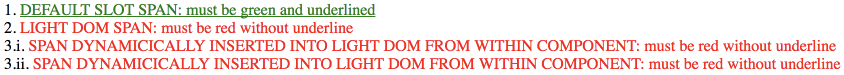

# shadowdom-slot-styling-specifics

In this example I want to show specifics of styling slotted content in different cases:

1. Default slot content is styled by incapsulated styles only.
2. Defined slot content is styled by external styles only.
3. Dynamically inserted slot into Light DOM from within component is styled by external styles only:
  - with default slot content;
  - with defined slot content.

In my opinion third option should not be recommended because it violates incapsulation.
However we use it exactly for the reason of applying external styles, as it seems to be less evil solution in a couple of cases.

